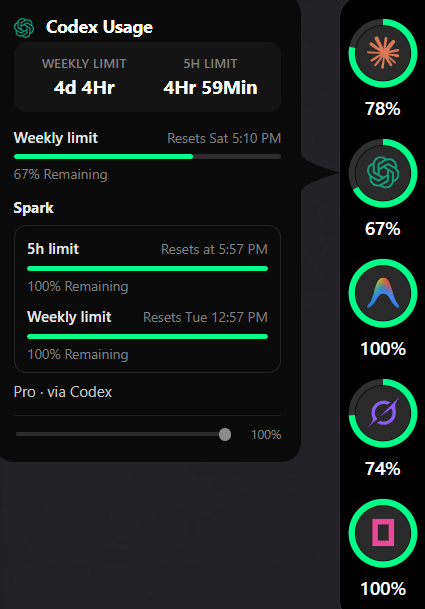

# Codenotch for Windows

A Windows port of [Codenotch](https://github.com/vinzdg/codenotch) — the usage notch that
sits on the edge of your screen and answers two questions at a glance:
**how much of my AI allowance is left**, and **is Claude still working**.

Same design language as the macOS original (inverse-rounded pill, colour-graded rings,
hover card with per-window bars), rebuilt for Windows in Rust + Tauri 2 / WebView2.
No code is copied from the Swift app; the providers are reimplemented from their
documented behaviour and the wire formats. **Windows is a first-class target, not an
afterthought** — this fork runs natively on Windows 11 (Rust + Tauri 2 / WebView2), no macOS
required.



*The pill on the right edge (Claude, Codex, Antigravity, Grok, OpenCode — five providers, five
distinguishable colours) and the Codex hover card: the large "4d 4Hr / 4Hr 59Min" box is the new
weekly/5h reset countdown, and every bar reads remaining, not used.*

*오른쪽 가장자리의 pill(Claude, Codex, Antigravity, Grok, OpenCode — provider 5개가 색으로
구분됨)과 Codex의 hover 카드: 크게 표시된 "4d 4Hr / 4Hr 59Min" 박스가 새로 추가된 주간/5시간
리셋 카운트다운이고, 모든 막대는 사용량이 아니라 잔여량 기준입니다.*

## What it shows

| Cell | Source | How it reads it |
|---|---|---|
| **Claude** | `GET https://api.anthropic.com/api/oauth/usage` with the token Claude Code keeps in `~/.claude/.credentials.json` | Session / weekly windows, 429 back-off with a persisted deadline, stale readings dimmed with their age. Renews that token by running the standalone `claude -p` shortly before it expires (Claude Code inside the desktop app never writes this file), and never sends an expired one. A thin arc spins inside the ring while a Claude session is working, and pulses amber when one is waiting on you (Claude Code hooks + transcript watcher, desktop app included). |
| **Codex** | The local Codex sign-in in `~/.codex/auth.json` (read only, never refreshed), falling back to the newest session snapshot | Live primary/secondary windows (5h + weekly on paid plans, a monthly window on free) while Codex is signed in; Spark and Code review appear on the hover card when Codex reports them; otherwise the last snapshot, marked stale by its own timestamp. |
| **Cursor** | The editor's own session from `state.vscdb` → `cursor.com/api/usage-summary` | Included usage / API usage / on-demand, reset at billing-cycle end. Nothing to sign into: it borrows the editor's session, so there is only ever one account. |
| **Antigravity** | Official `agy` CLI `/usage` print when installed; otherwise the existing local `language_server` bridge, Google Cloud Code API, or transcript model count | Official four quota rows (Gemini & Claude/GPT 5h/weekly) without running the full IDE. When CLI is absent, falls back to legacy local bridge/API. |
| **Grok** | `~/.grok/auth.json` (only a session minted by `auth.x.ai` is trusted), read only | `GET cli-chat-proxy.grok.com/v1/billing?format=credits` — the weekly Grok Build allowance, with a "Weekly limit" placeholder at 0% on a fresh plan that has not metered anything yet. |
| **OpenCode (Go)** | The `opencode-go` key in `~/.local/share/opencode/auth.json`, written by OpenCode's own sign-in | `GET opencode.ai/zen/go/v1/usage` — rolling (5h) / weekly / monthly Go-plan windows; a key with no Go plan reads as "nothing metered", not an error. |

Providers that are not installed simply do not get a cell.

### Antigravity

- **Official CLI (Preferred)**: When the official Antigravity CLI (`agy.exe`) is installed (`%LOCALAPPDATA%\agy\bin\agy.exe` or on `PATH`) and signed in, Codenotch reads official quotas directly without keeping the full IDE running.
- **Execution**: Runs the official CLI in a hidden Windows pseudo-console, with a 70-second timeout and cleanup of its process tree. It does not need PowerShell scripts or a separate service.
- **Refresh**: Checks at startup and on hover/explicit request when readings are at least five minutes old; failed attempts are also limited to once per five minutes. It keeps previous readings on failure, without switching to legacy APIs. The CLI is not launched periodically while idle.
- **Fallback**: When the official CLI is not installed, Codenotch preserves the legacy local bridge (`language_server`), Credential Manager, and transcript model turn counting to maintain compatibility with existing installations.
- **Official CLI Reference**: Standalone `/usage` printing is described in the [official Antigravity CLI documentation](https://www.antigravity.google/docs/cli/headless). Note: no categorical Terms of Service guarantee is made.

Restart Codenotch after installing or removing `agy`: the source is selected at startup.
The CLI's text report is parsed defensively; an unsupported format or failed sign-in
shows an error or the last reading marked stale. Codenotch does not automate sign-in.

## Install / build

Prerequisites: Rust (MSVC toolchain), WebView2 runtime (ships with Windows 11).

```powershell
# from this directory (the repo root here; `windows/` inside the upstream repo)
cargo build --release
.\target\release\codenotch.exe          # pill appears on the right edge of the primary monitor
.\target\release\codenotch.exe doctor   # self-diagnosis: credentials, data sources, icons, hooks
```

Tray menu: **Settings…**, **Refresh usage now**, **Quit**. Everything else is in the settings
window: the taskbar icon, which rings the notch shows, its size, start with Windows, the
language, Claude Code hooks, reset position, and the data folder (`%APPDATA%\codenotch` —
logs, persisted readings, icon overrides).

### Icons

Provider marks are the SVGs from [`@lobehub/icons-static-svg`](https://github.com/lobehub/lobe-icons)
(MIT), embedded unmodified — see `codenotch/glyphs/NOTICE.md`. Drop your own
`claude|codex|cursor|gemini|grok|opencode.svg` (or `.png`) into `%APPDATA%\codenotch\glyphs\` to
override. The marks remain the trademarks of their owners.

Glyph priority is: your override → the icon of the app actually installed on this machine (full
colour) → the built-in mark. Claude and Antigravity ship an official full-colour mark; OpenAI
(Codex), Cursor, xAI (Grok) and OpenCode publish monochrome-only logos, so those four are tinted
with a distinguishing accent instead (not an official brand colour — see `BRAND_TINT` in
`codenotch/ui/notch.html`) so the five-plus cells stay tellable apart at a glance.

## Layout

```
.
├── codenotch/          the Windows app (pill, hover card, settings, providers)
└── codenotch-hook/     tiny helper Claude Code calls to report session events
```

A pull request that touches this tree is built and tested; the check is skipped
inside forks until the pull request is opened here.

## What's different in this fork

This fork ([toughCSB/codenotch](https://github.com/toughCSB/codenotch)) adds on top of the
`windows/` tree above:

- **Two more providers**: Grok (`~/.grok/auth.json` → the weekly Grok Build allowance) and
  OpenCode Go (`~/.local/share/opencode/auth.json`'s `opencode-go` key → rolling/weekly/monthly
  Go-plan windows). Same read-only, never-refresh-the-token discipline as every other provider here.
- **Shows remaining, not used**: the ring, the percentage under it, and the hover card's window
  bars all read `100% − used%` now — e.g. a plan at 24% used shows **76%**, not 24%. The colour
  bands (green/yellow/red) still key off actual usage, unchanged.
- **Weekly by default**: every provider's ring now reads its *weekly* window by default (Claude:
  the all-models weekly window instead of the session; Codex: the secondary/weekly window instead
  of the primary/5h; OpenCode: `weekly` instead of `rolling`; Antigravity: the "Weekly" reading
  instead of "Automatic"). Cursor is unchanged — it has no weekly window, only a monthly billing
  cycle. The full detail (including the fast-moving 5h/session window) is still on the hover card.
- **A large reset countdown on the hover card**: above the per-window detail list, a highlighted
  box now shows the weekly and 5-hour resets as a duration — `3d 14Hr`, `5Hr 22Min` — instead of
  making you read a clock time or day-of-week and do the subtraction yourself.
- **Colour-tinted icons**: Claude and Antigravity already ship an official full-colour mark and now
  use it. OpenAI (Codex), Cursor, xAI (Grok) and OpenCode publish monochrome-only logos — there is
  no official colour to show — so those four get a distinguishing accent tint instead, clearly
  **not** an official brand colour, just a way to tell six cells apart at a glance.

None of this touches the credential/security discipline of the upstream code: every provider still
only *reads* an existing sign-in, never writes or refreshes a token, and a 401/403/429 is handled
the same conservative way (back off, mark stale, never invent a number).

## 이 포크에서 달라진 점

이 포크([toughCSB/codenotch](https://github.com/toughCSB/codenotch))는 위 `windows/` 트리에 다음을
추가했습니다:

- **Provider 2개 추가**: Grok(`~/.grok/auth.json` → 주간 Grok Build 사용량)과 OpenCode Go
  (`~/.local/share/opencode/auth.json`의 `opencode-go` 키 → rolling/weekly/monthly Go 플랜 윈도우).
  다른 provider들과 동일하게 읽기 전용이며 토큰을 절대 새로 발급/갱신하지 않습니다.
- **사용량이 아니라 잔여량 표시**: 링, 그 아래 퍼센트 숫자, hover 카드의 window 막대가 모두
  `100% − 사용량%`로 바뀌었습니다 — 24% 사용했다면 이제 **76%**로 표시됩니다. 색상 밴드
  (초록/노랑/빨강)는 실제 사용량 기준 그대로입니다.
- **기본값이 Weekly(주간)로 변경**: 모든 provider의 링이 기본적으로 *주간* 윈도우를 읽습니다
  (Claude: session 대신 전체 모델 주간 윈도우, Codex: primary/5시간 대신 secondary/주간 윈도우,
  OpenCode: rolling 대신 weekly, Antigravity: "Automatic" 대신 "Weekly"). Cursor는 주간 개념이
  없어서(월별 결제 주기만 있음) 그대로 뒀습니다. 세션/5시간 같은 세부 정보는 hover 카드에 그대로
  남아 있습니다.
- **hover 카드에 큰 리셋 카운트다운 추가**: 세부 window 목록 위에, 위클리·5시간 리셋까지 남은
  시간을 `3d 14Hr`, `5Hr 22Min` 같은 형식으로 크게 보여주는 박스를 추가했습니다. 시계 시각이나
  요일을 보고 직접 계산할 필요가 없습니다.
- **아이콘 컬러 구분**: Claude와 Antigravity는 원래 공식 컬러 마크가 있어서 그걸 그대로 씁니다.
  OpenAI(Codex)·Cursor·xAI(Grok)·OpenCode는 공식 로고 자체가 흑백 단색이라 보여줄 공식 컬러가
  없어서, 이 네 개는 구분을 위한 강조색을 입혔습니다 — **공식 브랜드 컬러가 아니라** 여섯 개
  셀을 한눈에 구분하기 위한 선택입니다.

이 변경들은 원본 코드의 크리덴셜/보안 원칙을 건드리지 않습니다: 모든 provider는 여전히 기존
로그인 상태를 *읽기만* 하고 토큰을 쓰거나 갱신하지 않으며, 401/403/429는 기존과 동일하게
보수적으로(백오프, stale 표시, 숫자를 지어내지 않음) 처리합니다.

## Relationship to upstream

This port follows the upstream design and provider semantics. It is developed at
[Im-Midi/codenotch-windows](https://github.com/Im-Midi/codenotch-windows) and offered to the
upstream project as its `windows/` tree; the two are kept in sync. Session detection
originated in [Im-Midi/Pac-Man](https://github.com/Im-Midi/Pac-Man) (MIT).

## License

MIT — see `LICENSE`. The Codenotch design and name belong to the upstream author.
